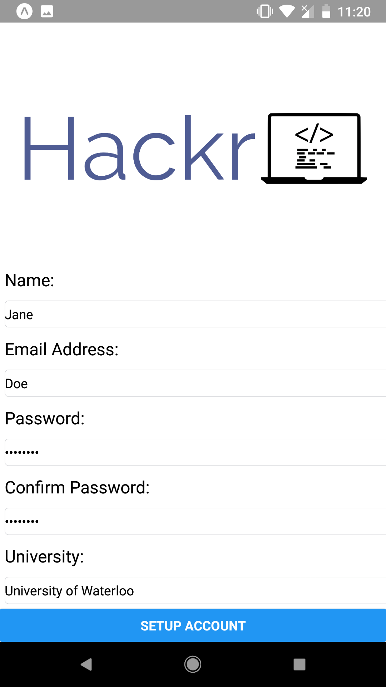
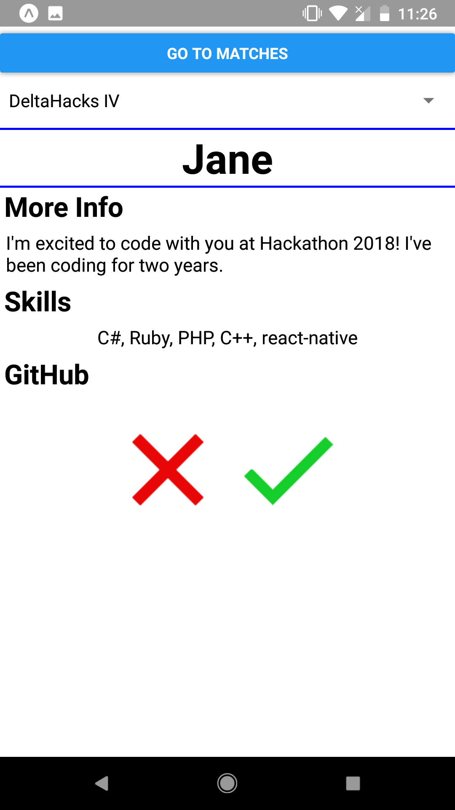
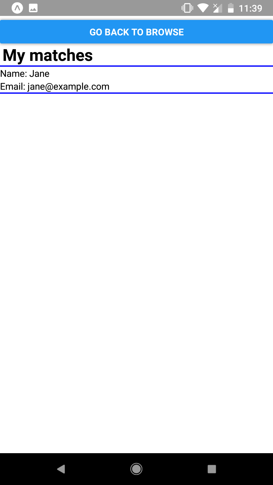

<p align="center">
  
</p>

A mobile application aimed to match hackathon members with groups. Created the mobile app with react-native, and the backend api endpoints in PHP and laravel. Created during DeltaHacks.

Created by [David Negrazis](https://github.com/davidnegrazis), [Drake Morin](https://github.com/drakemorin), and [Jacob Steves](https://github.com/jacobsteves)

Sign Up |  More About the Hacker | Skills Card | Matches
:----------:|:-------:|:-------:|:-------:
 |  |  | 

## Table of Contents
- [Technologies](#technologies)
    - [Backend](#backend)
    - [Frontend](#frontend)
- [Getting Started](#getting-started)
    - [Prerequisites](#prerequisites)
        - [Backend Hosting](#backend-hosting)
        - [Frontend Hosting](#frontend-hosting)
    - [Installation](#installation)
        - [Installing Laravel](#installing-laravel)
        - [Starting the PHP Server](#starting-the-php-server)
        - [Starting the Frontend](#starting-the-frontend)
- [Versioning](#versioning)
- [License](#license)

# Technologies
### Backend
The backend was developed in PHP using a [Laravel](https://laravel.com/) framework.

The entire web api was engineered from scratch. Calls to `http://app/api/action` return various JSON objects depending on the action. User authentication was also handled, ensuring that the user must be signed in with an active Authentication Token in order to access the apps data.

### Frontend
The frontend was developed in JavaScript, [React-Native](https://facebook.github.io/react-native/), and [Redux](https://redux.js.org/docs/introduction/). 

There are various components, actions, and reducers in the app that give the app functionality and global state. The app touches the React-Native app lifestyle, as well as state handling and asyncronous storage. To grab the app data, some actions make ajax REST api requests to our web hosted backend.

# Getting Started
## Prerequisites
### Backend Hosting
- PHP version 7.1, to install (on mac), run:
```
curl -s http://php-osx.liip.ch/install.sh | bash -s 7.1
```

- Install composer. Run:
```
php -r "copy('https://getcomposer.org/installer', 'composer-setup.php');"
php -r "if (hash_file('SHA384', 'composer-setup.php') === '544e09ee996cdf60ece3804abc52599c22b1f40f4323403c44d44fdfdd586475ca9813a858088ffbc1f233e9b180f061') { echo 'Installer verified'; } else { echo 'Installer corrupt'; unlink('composer-setup.php'); } echo PHP_EOL;"
php composer-setup.php
php -r "unlink('composer-setup.php');"
```
This will add composer to the current directory.

- If you want, move composer to your bin to use it locally. Run:
```
mv composer.phar /usr/local/bin/composer
```

- Download [Ngrok](https://ngrok.com/3)

### Frontend Hosting
- Download the [Expo](https://expo.io/) mobile application

## Installation
### Installing Laravel
- Install Laravel Globally. Run:
```
composer global require "laravel/installer"
```

- Update your $PATH variable so that laravel can be located by your system
     - On Mac, in .bash_profile (or .zshrc, if you're using zsh), add
     ```
     export PATH=$PATH:$HOME/.composer/vendor/bin
     ```
     - On Linux / GNU, follow installation guide [here](https://laravel.com/docs/5.5/installation)

- Finally, run
```
composer install
```
to install all the dependancies

- copy `.env.example` to `.env`
     - Note: `.env` is specific to each project, never commit this file

### Starting the PHP Server
- You must generate an application encryption key. Do so by running this command:
```
php artisan key:generate
```
- Now start the server:
```
php artisan serve
```

- If you are planning on running the frontend simultaneously, run:
```
ngrok http 8000
```
and update APP_BACKEND_URL in `/frontend/actions/ActionTypes.js` to be the url given by Ngrok

### Starting the Frontend
- Run:
```
npm install && npm start
```

- In the expo app, scan the QR Code and start coding!


## Versioning

We use [SemVer](http://semver.org/) for versioning. For the versions available, see the [tags on this repository](https://github.com/jacobsteves/Hackr/tags).

## License

This project is licensed under the MIT License - see the [LICENSE](LICENSE) file for details
